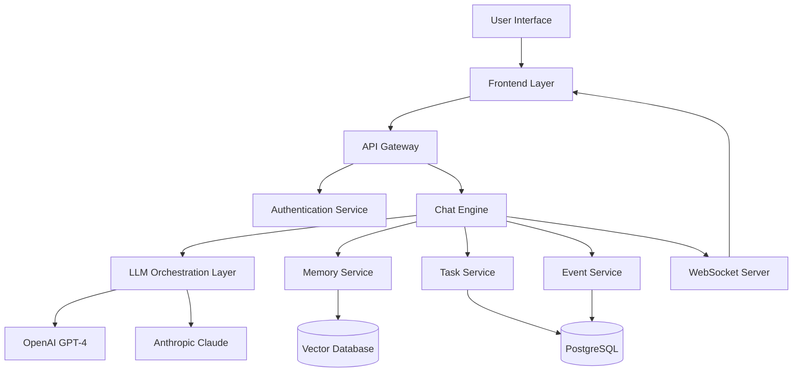
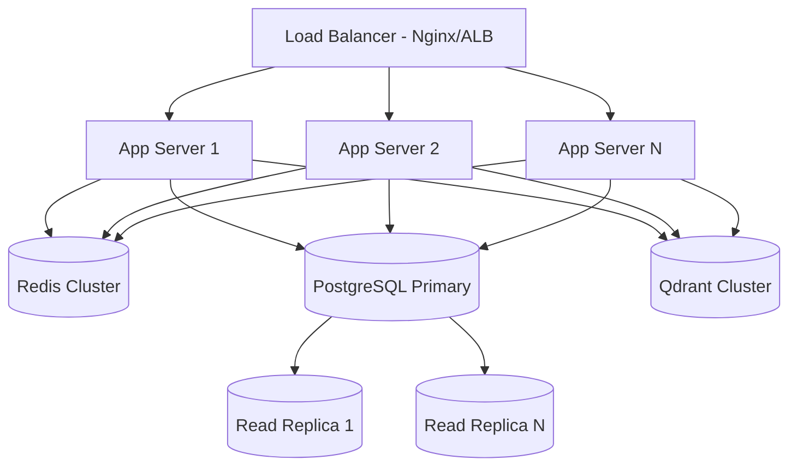

# Pixie - AI Secretary Product Documentation

## Executive Summary

**Pixie** is a production-grade AI-powered personal secretary designed to solve the fundamental problem of information overload and task management across multiple responsibilities. Unlike traditional productivity tools, Pixie provides **persistent long-term memory** combined with intelligent natural language interaction, enabling users to offload their mental burden to an AI that genuinely never forgets.

### Core Value Proposition
- **Never Forgets**: Persistent memory of all tasks, events, deadlines, meetings, and context shared by the user
- **Natural Interaction**: Conversational interface eliminates the friction of traditional task management
- **Proactive Assistance**: Daily summaries, timely reminders, and intelligent suggestions
- **Context-Aware**: Learns user preferences and working patterns over time

---

## Product Architecture

### High-Level System Design



### Technology Stack (Research-Based Recommendations)

#### **Frontend Layer**
- **Framework**: **Next.js 15** (App Router)
  - **Rationale**: Production-grade React framework with built-in SSR, optimal for SEO, excellent DX, full-stack capabilities
  - Server-side rendering for initial load performance
  - API routes for backend integration
  - Automatic code splitting and optimization
  - Edge runtime support for global deployment
  
- **Language**: TypeScript
- **Styling**: Vanilla CSS with design tokens (for maximum flexibility and no runtime overhead)
- **State Management**: React Context + React Query for server state
- **Real-time**: Socket.io Client for bidirectional communication

#### **Backend Layer**
- **Framework**: **Node.js with FastAPI hybrid approach**
  - **Primary API**: Node.js + Express/Fastify for main application logic
    - **Rationale**: Best for real-time features, I/O-bound operations, unified JavaScript stack
    - Excellent ecosystem for WebSocket/Socket.io
    - Fast iteration and large community
  
  - **AI/ML Service**: Python + FastAPI for LLM orchestration
    - **Rationale**: Superior LLM library ecosystem, async-first design, excellent performance
    - Handles embedding generation and vector operations
    - Isolated service for AI-specific workloads

- **Language**: TypeScript (Node.js) + Python (FastAPI)
- **API Pattern**: REST + GraphQL (for complex queries) + WebSockets (real-time)
- **ORM**: **Prisma**
  - **Rationale**: Excellent DX, type safety, Prisma Studio for data management, robust migration system
  - Faster type checking than alternatives
  - Built-in query optimization

#### **Database Layer**

**Primary Database: PostgreSQL 16**
- Structured data storage (tasks, events, users, sessions)
- ACID compliance for transactional integrity
- Advanced indexing and query optimization
- Row-level security support
- **Rationale**: Best balance of reliability, features, and community support

**Vector Database: Qdrant**
- Semantic memory storage and retrieval
- Embedding vectors for contextual understanding
- Hybrid search (dense + sparse vectors + metadata filtering)
- **Rationale**: 
  - Excellent performance-to-cost ratio
  - Open-source with commercial support available
  - Rust-powered efficiency
  - Superior for cost-sensitive workloads
  - Strong filtering capabilities

**Caching Layer: Redis**
- Session management
- API response caching
- Rate limiting
- WebSocket presence tracking

#### **AI/LLM Integration**

**Multi-LLM Strategy:**

1. **Primary LLM: Anthropic Claude 3.5 Sonnet**
   - **Use Cases**: 
     - Complex task interpretation
     - Long-form context analysis
     - Code-related queries
     - Nuanced conversation handling
   - **Rationale**: Superior instruction following, better context understanding, extended thinking mode

2. **Secondary LLM: OpenAI GPT-4o**
   - **Use Cases**:
     - Quick responses
     - General queries
     - Multimodal capabilities (future: voice, images)
   - **Rationale**: Broad ecosystem, fast responses, cost-effective for simple queries

**LLM Orchestration Approach:**
- Vendor-agnostic architecture with provider adapters
- Dynamic routing based on query complexity and cost
- Fallback mechanisms for reliability
- Cost tracking and optimization
- Function calling for tool execution (create_task, fetch_events, search_memory, etc.)

#### **Authentication & Authorization**
- **Solution**: **Clerk**
  - **Rationale**: 
    - Best DX for Next.js integration
    - Pre-built UI components
    - Built-in MFA and security features
    - Generous free tier (10,000 MAUs)
    - Zero-configuration security
  - JWT-based authentication
  - OAuth providers (Google, GitHub, etc.)
  - Magic link support

#### **Real-Time Communication**
- **Technology**: **Socket.io**
  - **Rationale**:
    - Robust abstraction over WebSockets
    - Automatic reconnection and heartbeat
    - Room-based broadcasting
    - Horizontal scaling support with Redis adapter
  - Use cases: Live updates, typing indicators, instant notifications

#### **Deployment & Infrastructure**

**Recommended Stack: AWS for production-grade control**

1. **Application Hosting**:
   - **Frontend**: AWS Amplify or Vercel (for simplicity)
   - **Backend API**: AWS ECS Fargate (containerized Node.js)
   - **AI Service**: AWS Lambda + ECS (hybrid for cost optimization)
   - **Alternative** (cost-conscious startups): Railway for unified deployment

2. **Database Hosting**:
   - **PostgreSQL**: AWS RDS with Multi-AZ deployment
   - **Qdrant**: Self-hosted on EC2 or managed Qdrant Cloud
   - **Redis**: AWS ElastiCache

3. **CDN & Edge**:
   - AWS CloudFront for global content delivery
   - Edge caching for static assets

4. **Storage**:
   - AWS S3 for file storage (future: documents, attachments)

#### **Monitoring & Observability**
- **APM**: **Datadog**
  - **Rationale**: Unified platform, excellent AI/LLM monitoring, comprehensive coverage
  - Application performance monitoring
  - LLM observability (token tracking, cost monitoring)
  - Infrastructure monitoring
  - Custom dashboards

- **Error Tracking**: **Sentry**
  - **Rationale**: Developer-first, excellent debugging, AI-powered root cause analysis
  - Frontend error tracking
  - Backend exception monitoring
  - Performance monitoring
  - Session replay for UI bugs

#### **Development Tools**
- **Version Control**: Git + GitHub
- **CI/CD**: GitHub Actions
- **Container Orchestration**: Docker + Docker Compose (local) / AWS ECS (production)
- **API Testing**: Postman/Insomnia
- **Load Testing**: k6 or Artillery

---

## Core Features & User Flows

### 1. Task Management

**User Experience:**
```
User: "I need to fix the authentication bug in Avenue project by Friday"
Pixie: "✓ Created task: 'Fix authentication bug - Avenue' due Friday, Jan 17"
```

**Behind the Scenes:**
1. User message received via WebSocket
2. Message sent to LLM with conversation history
3. LLM identifies intent: CREATE_TASK
4. LLM executes function call: `create_task(title, project, due_date)`
5. Task stored in PostgreSQL
6. Embedding generated and stored in Qdrant
7. Confirmation sent back via WebSocket
8. UI updates in real-time

**Database Schema (Tasks):**
```sql
CREATE TABLE tasks (
  id UUID PRIMARY KEY,
  user_id UUID NOT NULL,
  title TEXT NOT NULL,
  description TEXT,
  project TEXT,
  status TEXT DEFAULT 'pending',
  priority TEXT,
  due_at TIMESTAMP,
  created_at TIMESTAMP DEFAULT NOW(),
  updated_at TIMESTAMP DEFAULT NOW(),
  FOREIGN KEY (user_id) REFERENCES users(id)
);
```

### 2. Event/Calendar Management

**User Experience:**
```
User: "Schedule a meeting with the design team on Wednesday at 3 PM"
Pixie: "✓ Event added: 'Design team meeting' on Wed, Jan 15 at 3:00 PM"

User: "Am I free on Wednesday afternoon?"
Pixie: "No, you have: Design team meeting at 3:00 PM"
```

**Features:**
- Natural language date/time parsing
- Conflict detection
- Recurring events support
- Calendar integration (Google Calendar, Outlook - future)

### 3. Memory & Context Retrieval

**User Experience:**
```
User: "What were my action items from last week's sprint review?"
Pixie: [Searches vector database for semantic matches]
       "From your sprint review last Tuesday:
        1. Optimize API response times
        2. Update documentation for auth flow
        3. Schedule 1:1 with Sarah"
```

**Memory Architecture:**
- **Short-term memory**: Recent conversation history (last 20 messages)
- **Long-term memory**: Embeddings in vector database
- **Hybrid retrieval**: 
  - Vector similarity search for semantic matches
  - Metadata filtering for structured queries (date ranges, projects)
  - Re-ranking for relevance

### 4. Daily Summaries (Proactive)

**Automation Flow:**


**Example Summary:**
```
Good morning! Here's your day:

📅 Today's Schedule:
- 10:00 AM: Stand-up meeting
- 2:00 PM: Client presentation
- 4:00 PM: Code review session

 Pending Tasks (3):
- Finish API documentation
- Review pull request #234
- Update deployment scripts

 Overdue (1):
- Submit expense report (due yesterday)
```

---

## Data Flow Examples

### Example 1: Creating a Task

```typescript
// Frontend (Next.js)
const sendMessage = async (message: string) => {
  socket.emit('chat:message', { message, userId });
};

// Backend (Node.js WebSocket Server)
socket.on('chat:message', async ({ message, userId }) => {
  // 1. Fetch recent chat history
  const history = await getRecentMessages(userId, 10);
  
  // 2. Call LLM service
  const response = await llmService.processMessage({
    message,
    history,
    userId,
    tools: ['create_task', 'fetch_tasks', 'update_task', 'search_memory']
  });
  
  // 3. Execute tool calls if any
  if (response.toolCalls) {
    for (const tool of response.toolCalls) {
      if (tool.name === 'create_task') {
        const task = await prisma.task.create({
          data: {
            userId,
            title: tool.args.title,
            dueAt: tool.args.dueAt,
            // ... other fields
          }
        });
        
        // Generate embedding for semantic search
        await vectorDB.upsert({
          id: task.id,
          vector: await generateEmbedding(task.title + ' ' + task.description),
          metadata: {
            type: 'task',
            userId,
            createdAt: task.createdAt
          }
        });
      }
    }
  }
  
  // 4. Send response back
  socket.emit('chat:response', response);
});
```

### Example 2: Semantic Memory Search

```python
# AI Service (FastAPI)
from qdrant_client import QdrantClient
from openai import OpenAI

@app.post("/api/search-memory")
async def search_memory(query: str, user_id: str, limit: int = 5):
    # 1. Generate query embedding
    embedding = await generate_embedding(query)
    
    # 2. Search vector database
    results = qdrant.search(
        collection_name="user_memory",
        query_vector=embedding,
        query_filter={
            "must": [
                {"key": "user_id", "match": {"value": user_id}}
            ]
        },
        limit=limit,
        with_payload=True
    )
    
    # 3. Fetch full objects from PostgreSQL
    memory_ids = [r.id for r in results]
    memories = await fetch_memories_by_ids(memory_ids)
    
    return {
        "results": memories,
        "relevance_scores": [r.score for r in results]
    }
```

---

## Scalability Architecture

### Horizontal Scaling Strategy



**Key Scaling Patterns:**
1. **Stateless Application Tier**: Session data in Redis, not in-memory
2. **Database Read Replicas**: Distribute read traffic across replicas
3. **Caching Strategy**: API response caching, database query caching
4. **Socket.io Scaling**: Redis adapter for message broadcasting across instances
5. **Sticky Sessions**: Load balancer configuration for WebSocket connections
6. **Queue-Based Architecture**: Background jobs (email, embeddings) in job queue (Bull/BullMQ)

### Performance Targets
- **API Response Time**: p95 < 200ms
- **WebSocket Latency**: < 50ms for real-time messages
- **LLM Response Time**: p95 < 3s for simple queries, < 10s for complex
- **Concurrent Users**: Support for 10,000+ simultaneous connections
- **Uptime**: 99.9% SLA

---

## Security & Privacy

### Security Measures
1. **Authentication**: JWT-based with short expiry, refresh tokens
2. **Authorization**: Row-level security in PostgreSQL, user-scoped data
3. **Encryption**:
   - TLS/SSL for all communications (WSS for WebSockets)
   - Encryption at rest for database
   - API key rotation for LLM providers
4. **Rate Limiting**: Per-user and per-IP rate limits
5. **Input Validation**: Schema validation for all API inputs (Zod)
6. **CSRF Protection**: Token-based for state-changing operations
7. **CORS**: Strict origin whitelist
8. **Secrets Management**: AWS Secrets Manager or HashiCorp Vault

### Privacy Considerations
- **Data Ownership**: User owns all their data
- **Data Deletion**: Complete data removal on account deletion
- **LLM Provider Privacy**: 
  - No training on user data (opt-out agreements)
  - Data not retained by LLM providers
  - Consider self-hosted LLMs for enterprise (future)
- **Compliance**: GDPR-ready architecture

---

## Cost Optimization Strategy

### Estimated Monthly Costs (10,000 Users)

| Service | Provider | Configuration | Monthly Cost |
|---------|----------|---------------|--------------|
| **Frontend Hosting** | Vercel Pro | 5 members | $100 |
| **Application Servers** | AWS ECS Fargate | 4 tasks, 1vCPU, 2GB | $120 |
| **PostgreSQL** | AWS RDS | db.t4g.medium, Multi-AZ | $150 |
| **Redis** | AWS ElastiCache | cache.t4g.micro | $15 |
| **Vector DB** | Qdrant Cloud | Starter plan | $95 |
| **LLM API** | Anthropic + OpenAI | ~500k requests/month | $800 |
| **Monitoring** | Datadog + Sentry | Standard plans | $150 |
| **CDN/Bandwidth** | AWS CloudFront | ~1TB/month | $100 |
| **Secrets/Misc** | AWS services | Various | $50 |
| **Total** | | | **~$1,580/month** |

**Per-User Cost**: ~$0.16/month
**Recommended Pricing**: $10-15/month (Professional tier)
**Gross Margin**: ~99% at scale

### Cost Reduction Tactics
1. **LLM Cost Optimization**:
   - Route simple queries to GPT-4o-mini (cheaper)
   - Cache common responses
   - Limit context window size intelligently
   - Batch embedding generation

2. **Infrastructure**:
   - Use ARM-based instances (AWS Graviton - 20% cheaper)
   - Reserved instances for predictable workloads
   - Auto-scaling based on actual demand
   - Spot instances for non-critical background jobs

3. **Database**:
   - Read replicas only when needed
   - Table partitioning for large datasets
   - Efficient indexing strategy

---

## Future Enhancements

### Phase 2 Features
- **Voice Interface**: Speech-to-text integration (Whisper API)
- **Email Integration**: Gmail/Outlook sync for automatic task extraction
- **Document Processing**: Upload documents, extract tasks/events
- **Team Collaboration**: Shared workspaces, delegation features
- **Mobile Apps**: Native iOS and Android applications
- **Calendar Sync**: Bidirectional sync with Google Calendar, Outlook
- **Smart Suggestions**: ML-based task priority recommendations

### Phase 3 Features
- **Advanced Analytics**: Productivity insights, time tracking
- **Workflow Automation**: Custom automation rules (Zapier-like)
- **Plugin Marketplace**: Third-party integrations
- **Enterprise Features**: SSO, advanced security, team management
- **Local LLM Support**: Privacy-focused deployment option
- **Multi-language Support**: Internationalization

---

## Success Metrics

### Key Performance Indicators (KPIs)
- **User Engagement**: Daily Active Users (DAU), tasks created/day
- **Retention**: D7, D30 retention rates
- **Performance**: API latency, uptime percentage
- **AI Quality**: User satisfaction with AI responses, correction rate
- **Business**: Monthly Recurring Revenue (MRR), Customer Acquisition Cost (CAC)

### North Star Metric
**Tasks Completed per Active User per Week** - measures actual productivity value delivered

---

## Conclusion

Pixie is designed as a **production-grade**, **scalable**, and **intelligent** AI secretary that solves real pain points in personal productivity. The tech stack is carefully selected based on 2026 industry best practices, balancing:

- **Developer Experience**: Fast iteration and maintainability
- **Performance**: Sub-second response times, real-time capabilities
- **Cost Efficiency**: Optimized infrastructure spend
- **Scalability**: Ready to grow from 100 to 100,000+ users
- **Security**: Enterprise-grade protection and privacy
- **Reliability**: 99.9% uptime with robust monitoring

This document serves as the foundation for implementation planning and development execution.
